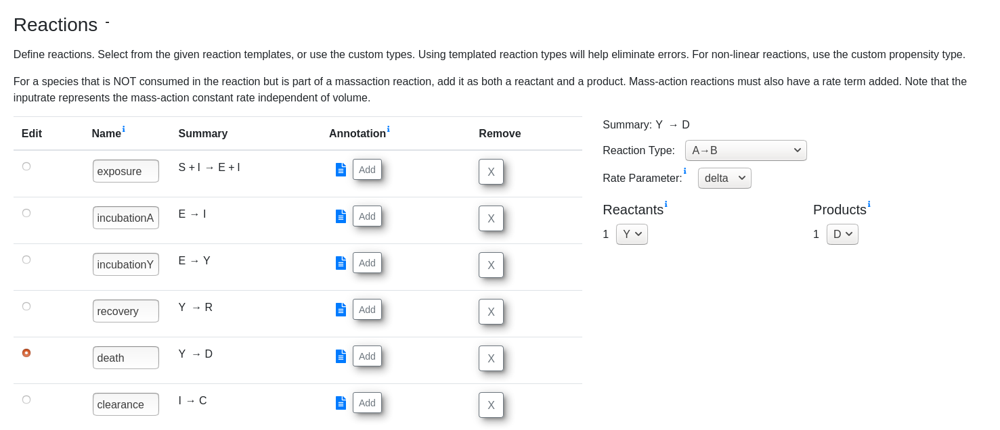
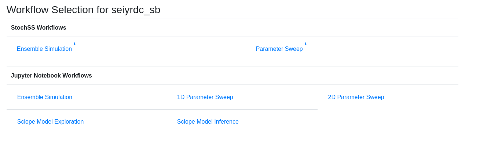
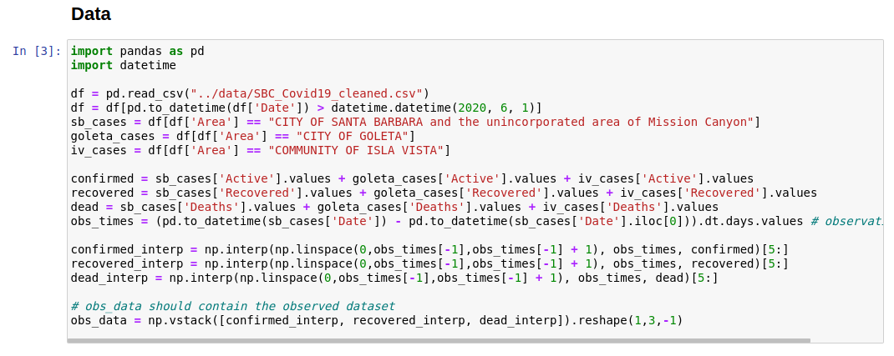
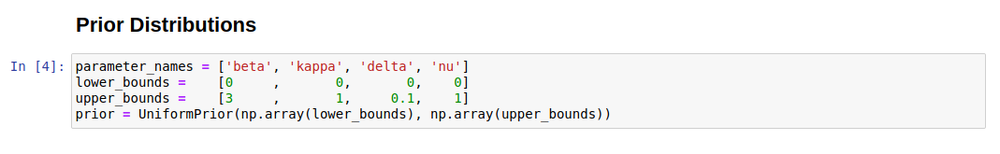
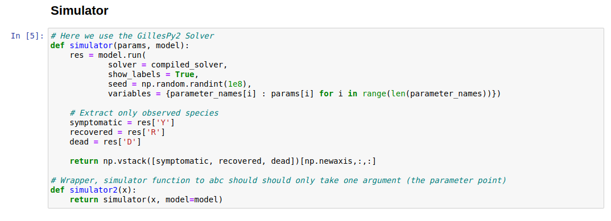
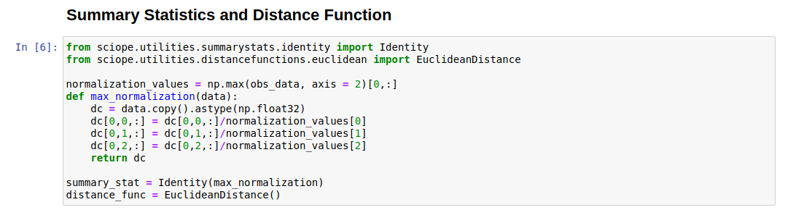
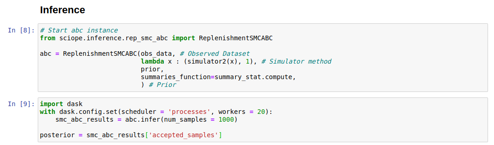
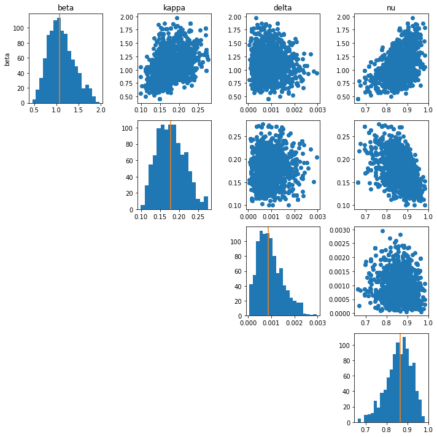

# Epidemiological Modeling with New StochSS 2.1

This repository provides an example of using StochSS to
implement a specific epidemiological and estimate the parameters for
a specific county.  StochSS can be found at https://app.stochss.org and the
repository can be directly downloaded and executed in the web interface to
replicate results.

## Table of Contents

- [Implementing An Epidemiological Model in StochSS](#implementing-an-epidemiological-model-in-stochss)
  - [Model Description](#model-description)
  - [Implementation](#implementation)
- [Parameter Estimation Workflow using ABC](#parameter-estimation-workflow-using-abc)
  - [Reading Data](#reading-in-data)
  - [ABC Requirements](#abc-requirements)
- [References](#references)

## Implementing An Epidemiological Model in StochSS

In the following, we describe the epidemiological model we use, and demonstrate
how it can be implemented in the StochSS web interface. Then we describe the
process of creating a parameter inference workflow for some local COVID19 data.

## Model Description

The epidemiological model we implement is an extended version of the
SEIRD model that accounts for symptomatic and asymptomatic cases. The involved
compartments (species) are: susceptible (S), exposed (E), infected (I),
symptomatic (Y), recovered (R), dead (D), and cleared (C).  The system can be
visualized as:

The system evolves according to SEIR dynamics but with a chance of becoming
symptomatic after being exposed.  In more detail, we have the following set of
reactions:

Susceptible + Infected → Infected + Exposed ($\beta/P$)   
Exposed → Infected  ($\0.16 (1 - \nu )$)  
Exposed → Symptomatic  ($0.16 \nu$)  
Symptomatic → Recovered  ($\kappa)  
Symptomatic → Dead ($\delta)  
Infected → Cleared  ($\kappa$)

This model assumes that *only asymptomatic transmission is possible*,
*all asymptomatic cases recover*, and that *all parameters are static*.

### Implementation

Using this specification, we can implement the model in StochSS in the model
creation interface

A pre-implemented version of this model with some default parameters can be
found [here](epidemiological/santa_barbara/seiyrdc_sb.mdl).

In the model creation interface, we can also preview trajectories if we were to
consider the model as either discrete stochastic or an ODE model.

After we are satisfied with our model, we can click "New Workflow" which allows
us to further analyze the model in a variety of different ways.

## Parameter Estimation Workflow using ABC

We estimate the parameters of the model for Santa Barbara and Buncombe
counties using the "Sciope Model Inference" workflow.  This automatically
creates a Jupyter notebook with many cells auto-populated.

The completed workflow is included for
[Santa Barbara, CA](epidemiological/santa_barbara/seiyrdc_sbSciopeMI.ipynb)
and
for [Buncombe, NC](epidemiological/buncombe/seiyrdc_buncombeSciopeMI.ipynb).

### Reading In Data

Data for estimating parameters should be loaded in the data block.  The
`obs_data` object should contain the final completed dataset.

### ABC Requirements

To use the Approximate Bayesian Computation [TODO: ADD REFERENCE ABC]algorithms
 in the Sciope library, we need to complete the following parts of the notebook:

1. Prior cell

2. Simulator function

This function should take in a parameter array and output a simulation from the
model that matches the shape of the observed data.

We make one modification because our data consists of observations of
the symptomatic, recovered, and dead cases.  Therefore, the
output of this function should only return those three species.  For SB,
this is broken down into these 3 but for Buncombe, we observe cumulative
symptomatic and recovered.

3. Summary Statistics and Distance Functions

### Estimating Parameters and Analyzing Posteriors

The default algorithm we use is Replenishment ABC-SMC.  Sciope uses dask
to parallelize inference so we use the StochSS servers to use more processes.

The inference returns a `np.array` of samples from the the posterior
distribution stored in the `posterior` object.  Each sample can be used
as a set of parameters in the model to generate further trajectories.

Below, we show the posterior distribution of parameters for Santa Barbara as
well as generated data from the model using the posterior samples
(posterior predictive).

## References
