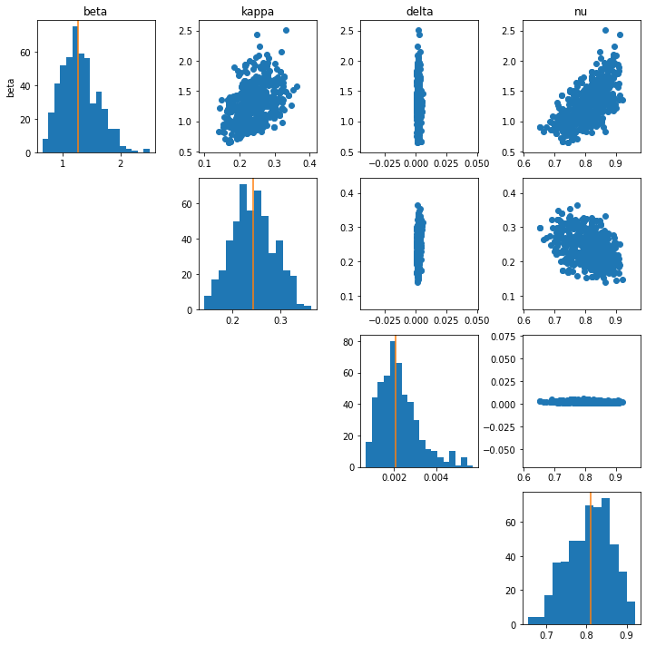

# Covid19_Modeling

This repository provides an example of using StochSS to
implement a specific epidemiological and estimate the parameters for
a specific county.  StochSS can be found at https://app.stochss.org and the
repository can be directly downloaded and executed in the web interface to
replicate results.

In the following, we will describe the epidemiological model we will be using,
demonstrate how it can be implemented in the StochSS web interface, and finally
describe the process of reading in COVID19 data and estimating the parameters of
the implemented model.

## Model Description

The epidemiological model we will be building is an extended version of the
SEIRD model that accounts for symptomatic and asymptomatic cases. The involved
compartments (species) are: susceptible (S), exposed (E), infected (I),
symptomatic (Y), recovered (R), dead (D), and cleared (C).  The system can be
visualized as:

The system evolves according to SEIR dynamics but with a chance of becoming
symptomatic after being exposed.  In more detail, we have the following set of
reactions:

Susceptible + Infected → Infected + Exposed ($\beta/P$)   
Exposed → Infected  ($\0.16 (1 - \nu )$)  
Exposed → Symptomatic  ($0.16 \nu$)  
Symptomatic → Recovered  ($\kappa)  
Symptomatic → Dead ($\delta)  
Infected → Cleared  ($\kappa$)

This model assumes that *only asymptomatic transmission is possible*,
*all asymptomatic cases recover*, and that *all parameters are static*.

Using this specification, we can implement the model in StochSS in the model
creation interface

A pre-implemented version of this model with some default parameters can be
found [here](epidemiological/santa_barbara/seiyrdc_sb.mdl).

In the model creation interface, we can also preview trajectories if we were to
consider the model as either discrete stochastic or an ODE model.

After we are satisfied with our model, we can click "New Workflow" which allows
us to further analyze the model in a variety of different ways.

## Parameter Estimation

We will estimate the parameters of the model for Santa Barbara and Buncombe
counties using the "Sciope Model Inference" workflow.  This will automatically
create a Jupyter notebook with many cells auto-populated.

The completed workflow is included for
[Santa Barbara, CA](epidemiological/santa_barbara/seiyrdc_sbSciopeMI.ipynb)
and
for [Buncombe, NC](epidemiological/buncombe/seiyrdc_buncombeSciopeMI.ipynb).

## Parameter Estimation using ABC

We will estimate the parameters of the model using the Approximate Bayesian
Computation [TODO: ADD REFERENCE ABC]algorithms in the Sciope library.  To do this, we need to complete
the following parts of the notebook. In particular, we will use the
implemented Replenishment SMC-ABC algorithm [TODO: ADD REFERENCE REPSMCABC].

1. Prior distribution over parameters

We will use independent uniform priors over each parameter.

2. A method that takes in a parameter sample and outputs a simulation that matches
   the shape of the data

We make one modification because our data consists of observations of
the symptomatic, recovered, and dead cases.  Therefore, the
output of this function should only return those three species.  For SB,
this is broken down into these 3 but for Buncombe, we observe cumulative
symptomatic and recovered.

3. Summary Statistics and Distance Functions

For summary statistics, we normalize the output by the max and use the default
Euclidean distance.

## Analyzing the Results

We can look at the posterior distribution to get an idea of the possible
parameter values as well as uncertainty estimates.  The most interesting
parameter here is the $beta$, which corresponds to the infectivity of virus as
estimated from the data.  

