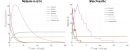
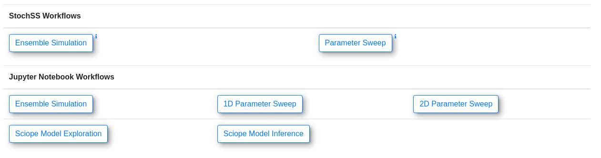

# Epidemiological Modeling with StochSS Live!

This repository provides an example of using StochSS Live! to
implement a specific epidemiological model and to estimate the parameters for
it for a specific county.  

StochSS Live! is the web interface for developing and investigating
stochastic models found at https://live.stochss.org.  All results can be replicated
by importing this repositories and notebooks into StochSS Live!.  

The libraries used by StochSS Live! for simulation and analysis are a part of the [StochSS suite of software](https://github.com/StochSS).

## Table of Contents

- [Implementing An Epidemiological Model in StochSS Live!](#implementing-an-epidemiological-model-in-stochss)
  - [Model Description](#model-description)
  - [Implementation](#implementation)
- [Parameter Estimation Workflow using ABC](#parameter-estimation-workflow-using-abc)
  - [Reading Data](#reading-in-data)
  - [ABC Requirements](#abc-requirements)
- [References](#references)

## Implementing An Epidemiological Model in StochSS Live!

In the following, we describe the epidemiological model we use, and demonstrate
how it can be implemented in the StochSS Live! web interface. Then we describe the
process of creating a parameter inference workflow for some local COVID19 data.

## Model Description

The epidemiological model we implement is an extended version of the
SEIRD model that accounts for symptomatic and asymptomatic cases. The involved
compartments (species) are: susceptible (S), exposed (E), infected (I),
symptomatic (Y), recovered (R), dead (D), and cleared (C).  The system can be
visualized as:

The system evolves according to SEIR dynamics but with a chance of becoming
symptomatic after being exposed.  We fix the rate at which exposed patients become infectious at 0.16, which represents ~6.25 day incubation period and estimate the proportion of patients who become infected vs. symptomatic.  This is roughly adopted from a similar model [[5]](#references).  Specifically, we have the following set of reactions:

Susceptible + Infected → Infected + Exposed  
Exposed → Infected    
Exposed → Symptomatic    
Symptomatic → Recovered  
Symptomatic → Dead   
Infected → Cleared  

This model assumes that *only asymptomatic transmission is possible*,
*all asymptomatic cases recover*, and that *all parameters are static*.

### Implementation

Using this specification, we can implement the model in StochSS Live! in the model
creation interface

A pre-implemented version of this model with some default parameters can be
found [here](epidemiological/santa_barbara/seiyrdc_sb.mdl).

In the model creation interface, we can also preview trajectories if we were to
consider the model as either discrete stochastic or an ODE model.

## Parameter Estimation Workflow using ABC

We estimate the parameters of the model for Santa Barbara and Buncombe
counties using the Sciope [[3]](#references) toolbox, part of the StochSS
suite of software which offers model exploration and parameter estimation.  A
pre-implemented template notebook can be generated by using
the "Sciope Model Inference" workflow in StochSS Live!.  

The completed workflow is included for
[Santa Barbara, CA](epidemiological/santa_barbara/seiyrdc_sbSciopeMI.ipynb)
and
for [Buncombe, NC](epidemiological/buncombe/seiyrdc_buncombeSciopeMI.ipynb).

### Reading In Data

Data for estimating parameters should be loaded in the data block.  The
`obs_data` object should contain the final completed dataset.

### ABC Requirements

Sciope implements various algorithms for Approximate Bayesian Computation [[2]](#references).
To use these, we need to complete the following segments of the notebook:

1. Prior cell

2. Simulator function

This function should take in a parameter array and output a simulation from the
model that matches the shape of the observed data.

We make one modification because our data consists of observations of
the symptomatic, recovered, and dead cases.  Therefore, thez
output of this function should only return those three species.  For SB,
this is broken down into these 3 but for Buncombe, we observe cumulative
symptomatic and recovered.

3. Summary Statistics and Distance Functions

### Estimating Parameters and Analyzing Posteriors

The default algorithm we use is Replenishment ABC-SMC [[3]](#references).  Sciope
uses Dask [[4]](#references) to parallelize inference so we use the StochSS Live!
servers to use more processes.

The inference returns a `np.array` of samples from the the posterior
distribution stored in the `posterior` object.  Each sample can be used
as a set of parameters in the model to generate further trajectories.

Below, we show the posterior distribution of parameters for Santa Barbara as
well as generated data from the model using the posterior samples
(posterior predictive).

Of importance is that the presented models do not really indicate a sufficient fit to the
data to draw any strong conclusions.  For a complete analysis, this process needs to
be repeated, changing the model to better capture assumptions about the system.
For example, we would expect the infectivity to change over time as policies are implemented and
we know that there are non-intrinsic measurement error, such as reporting errors in
the data.  

## References
 [1] Prashant Singh, Fredrik Wrede, Andreas Hellander, Scalable machine learning-assisted model exploration and inference using Sciope, Bioinformatics, , btaa673, https://doi.org/10.1093/bioinformatics/btaa673

 [2] Sisson, Scott A., Yanan Fan, and Mark Beaumont, eds. Handbook of approximate Bayesian computation. CRC Press, 2018.

 [3] C. C. Drovandi and A. N. Pettitt.  Estimation of parameters  for  macroparasite  population  evolution  us-ing approximate Bayesian computation.Biometrics,67(1):225–233, 2011.

 [4] Dask Development Team (2016). Dask: Library for dynamic task scheduling
URL https://dask.org

 [5] Flaxman, S., Mishra, S., Gandy, A. et al. Estimating the effects of non-pharmaceutical interventions on COVID-19 in Europe. Nature 584, 257–261 (2020). https://doi.org/10.1038/s41586-020-2405-7
